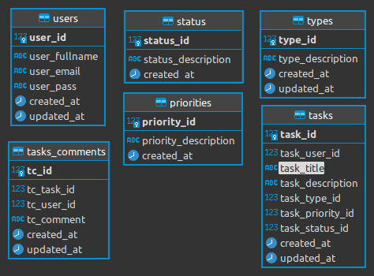
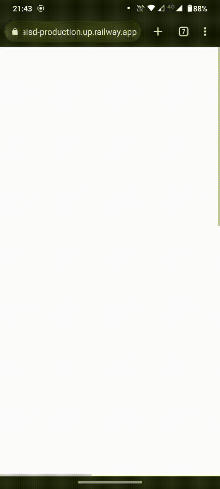
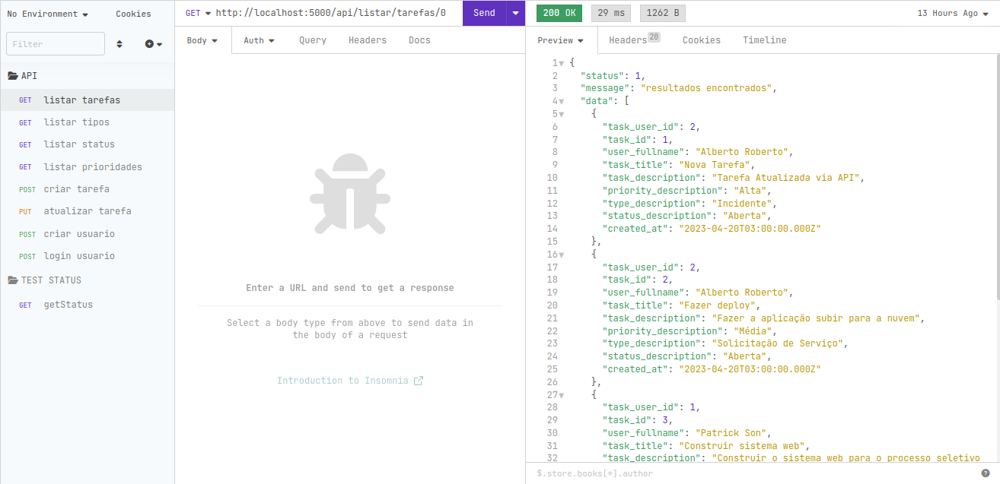
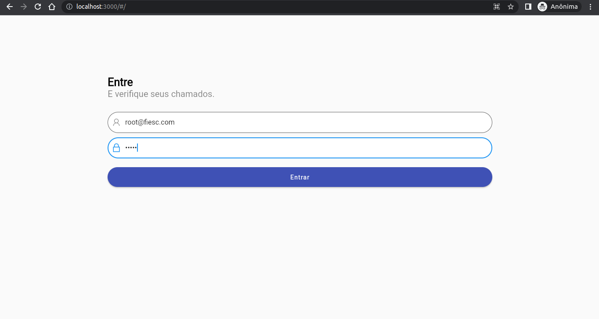
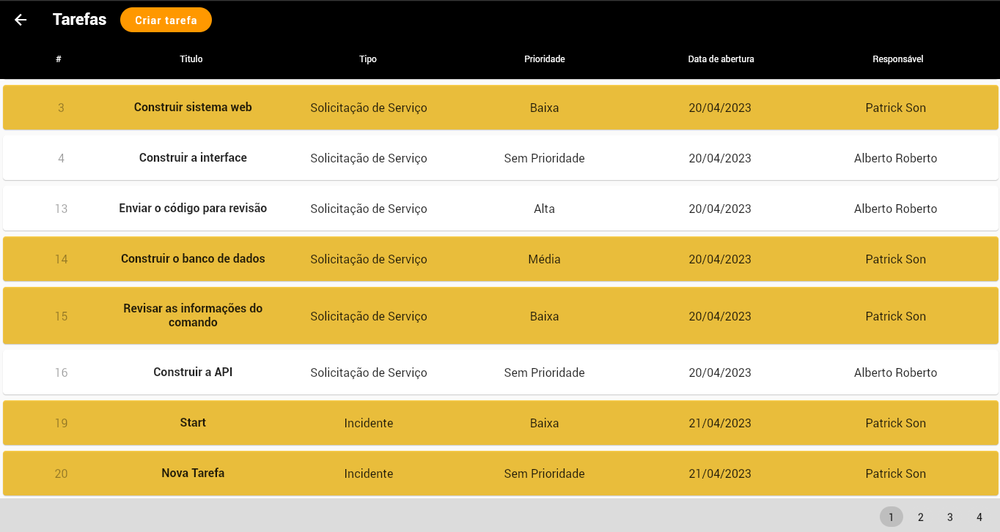
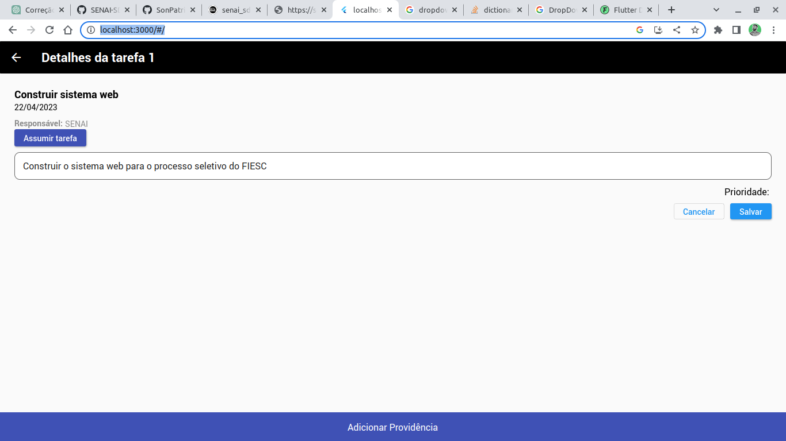
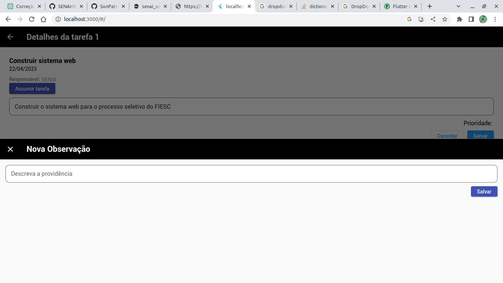

# Processo seletivo - QA

Bem vindo, candidato. 

Estamos felizes que você esteja participando do processo seletivo para a vaga de QA do Senai - Soluções Digitais.

A prova deverá utilizar as seguintes tecnologias: 
- Linguagem de programação orientada a objeto para web
- Banco de dados relacional
- GIT

Fica à sua escolha quais frameworks e servidor serão utilizados, desde que seja uma aplicação web. 

Na etapa da entrevista deverá ser apresentado a aplicação em funcionamento.

## Instruções para a execução da prova

A prova deve ser uma aplicação web. Você pode escolher a tecnologia que achar conveniente (PHP, JAVA, etc...).

O Banco utilizado na prova deve ser PostgrSQL.

Esse repositório possui apenas esse Readme com as instruções da prova. No entanto, **todo desenvolvimento deve ser commitado nesse repositório** até a data citada no email, enviado por nossa equipe.

Commite nesse repositório o script utilizado na criação do banco de dados (se aplicável).

Por fim, altere esse arquivo com as instruções de como poderemos testar o seu código (quais libs usar, qual servidor, etc) abaixo.

## Será avaliado
- Qualidade do código quanto a:
  - Facilidade no entedimento
  - Complexidade ciclomática
  - Divisão de resposabilidade das classes
  - Reutilização de código
- Qualidade quanto a interface:
  - Fácil usabilidade
  - Acessibilidade
  - Feedback ao usuário
- Qualidade quanto aos requisitos:
  - Desenvolvimento e funcionamento dos requisitos propostos.

## Informações extras

- Descreva ao final deste documento (Readme.md) o detalhamento de funcionalidades implementadas, sejam elas já descritas na modelagem e / ou extras.
- Detalhar também as funcionalidades que não conseguiu implementar e o motivo.
- Caso tenha adicionado novas libs ou frameworks, descreva quais foram e porque dessa agregação.

(Escreva aqui as instruções para que possamos corrigir sua prova, bem como qualquer outra observação sobre a prova que achar pertinente compartilhar)

  
# DOCUMENTAÇÃO DO SISTEMA
 

# **senai_sd**
Projeto SENAI_SD (SD de *Soluções Digitais*) desenvolvido para o teste prático do processo seletivo do FIESC.

## Descrição das funcionalidades implementadas

### Tecnologias utilizadas
O Projeto foi implementado utilizando as tecnologias/Frameworks:

    Flutter
    Node.js
    Postgres

### **Flutter**
A interface do usuário foi construída na linguagem `Dart` utilizando o Framework `Flutter`. Para isso, foram utilizadas as seguintes bibliotecas/pacotes:
    
* `http`: Para fazer requisições http
* `animate_do`: Proporciona um leque de animações fluídas para a UI
* `provider`: Gerencia de estado da aplicação
* `circular_clip_route`: Transição de telas 

A aplicação foi construída utilizando o padrão **MVC** (Model-View-Controller) para tornar o código compreensível e a regra de negócio de fácil manutenção.

### **Postgres**
O banco de dados foi projetado levando em consideração os requisitos descritos no documento. Gerando as seguintes tabelas:
  
> **Users**: Armazena os usuários do sistema,
> 
> **Tasks**: Armazena as tarefas,
> 
> **Task_Comments**: Armazena os comentários das tarefas,
> 
> **Types**: Armazena os tipos de tarefas, podendo ser usada para acrescentar mais tipos;
> 
> **Status**: Armazena a situação de tarefas, podendo ser usada para acrescentar mais situações possíveis;
> 
> **Priorities**:Armazena os tipos de prioridades que podem ser atribuídas às tarefas, podendo ser usada para acrescentar mais descrição de tipos;

A estrutura ficou como na imagem abaixo:  

### **Node.js**

O servidor foi desenvolvido utilizando `Javascript`, que é uma linguagem de programação que, assim como o `Dart`, suporta o paradigma **Orientado a Objeto**.  
A Arquitetura do sistema é monolítica, significando que a interface de usuário enconrta-se no mesmo projeto que a API e as respectivas regras de negócio.  
O projeto foi construído utilizando o padrão **MVC** complementando o mesmo padrão seguido na construção da regra de negócios da interface de usuário.

A UI foi construída usando a linguagem `Dart` e o `Framework Flutter`, que **renderizou a interface otimizada para Web**  que foi integrada junto ao projeto, formando o **monolito** da aplicação. 
O código da interface do usuário pode ser encontrado e analisado [aqui](https://github.com/SonPatrick/senai_sd_interface).  

A Aplicação Web foi construída usando `Javascript` com o framework `Node.js` e as bibliotecas:
    
> **connect-timeout**: Gerencia o tempo de requisição,
> 
> **cookie-parser**: Analisador e serializador básico de cookies HTTP para servidores HTTP,
> 
> **cors**: Pacote node.js para fornecer um middleware Connect/Express que pode ser usado para habilitar o CORS,
> 
> **dotenv**: Carrega as variáveis de ambiente;
> 
> **express**: Framework que oferece uma estrutura para a criação de servidores web de forma minimalista e rápida;
> 
> **helmet**: Biblioteca para proteger as requisições atribuindo cabeçalho às requisiçãoes;
> 
> **morgan**: Biblioteca para registro de logs de eventos no servidor;
> 
> **pg**: Biblioteca para conexão com o Postgres  

## Para testar a aplicação

A aplicação está hospedada na internet, porém apenas renderiza para mobile, bem [aqui](https://senaisd-production.up.railway.app/#/), porém a exibição ocorre apenas na versão mobile ainda. Como mostrado na imagem abaixo:

Você precisa ter instalado o `Node.js v18.9.0` ou superior e o `Postgres` em sua máquina.  
As variáveis de ambiente estão no arquivo `.env` na raíz do projeto e pode ser alterada de acordo com o host, usuário, nome do banco de dados, a senha e a porta.

> 1. Inicie Postgres;
> 2. Inicialize a aplicação Node.js com o comando:  `node app.js` ou com o comando `npm start`; 
> 3. Abra o navegador e digite: `http://localhost:3000/` para acessar a interface de aplicação (Se você for executar a aplicação em contêiner Docker, é necessário informar o IP de acesso e a porta por onde a aplicação é escutada e que são disponibilizados pelo Docker para acesso ao projeto);

### Teste nas requests
Para testar as requisições realizadas no servidor foi utilizado o software **Insomnia**, que pode ser baixado [aqui](https://insomnia.rest/download), podendo também ser usado o software **Postman**, que pode ser encontrado [aqui](https://www.postman.com/).

Você pode importar para o **Insomnia** os arquivos contendo as coleções de endpoints e requisições utilizados. Os arquivos para importação se encontram na pasta `./docs`

O script `.sql` se encontra na pasta `./docs` para importar no banco de dados.

## **Docker Container**
 Caso desejar, você pode gerar as imagens do **Docker** para rodar a aplicação dentro dos contêineres em servidores cloud que suportam `Node.js` e `Postgres`.   Atente que para possibilitar que a aplicação Web se conecte com o banco de dados em contêineres do Docker, é necessário usar o **Docker Compose**.

## Login

Para entrar no sistema que está no servidor web ([aqui](https://senaisd-production.up.railway.app/#/)), você pode usar um dos usuários previamente criados abaixo:

### USUÁRIO  `FIESC`
    
    Login: root@fiesc.com
    Senha: fiesc

### USUÁRIO  `SENAI`
    Login: senai@fiesc.com
    Senha: senai

Caso você deseje criar um usuário em sua máquina local, você pode usar a `endpoint` de criação de usuário que está informada mais abaixo neste documento.

Com esses dados você pode entrar no sistema para acessar as funcionalidades implementadas na API, que são

    [X] Login de usuário (RF1)
    [X] Exibição das tarefas cadastradas (RF2)
---
## **API da aplicação**
Você pode testar nos seguintes endpoints:  

### **Listar Tarefas com paginação**
**Endpoint:**  http://localhost:5000/api/listar/tarefas/:page 
**Parametro:**  [:page] número da página para exibir os resultados 
**Método:** GET 
**Response:**
  
    {
    "status": 1,
    "message": "resultados encontrados",
    "data": [{
        "task_user_id": 1,
        "task_id": 18,
        "user_fullname": "SENAI",
        "task_title": "Construir",
        "task_description": "Construir o sistema web para ",
        "priority_description": "Média",
        "type_description": "Solicitação de Serviço",
        "status_description": "Fechada",
        "created_at": "2023-04-21T03:00:00.000Z"
      }]
    }

 

### **Listar Tipos de Tarefas**
**Endpoint:**  http://localhost:5000/api/listar/tipos 
**Método:** GET 
**Response:**
  
    {
      "data": [
        {
          "type_id": 1,
          "type_description": "Incidente"
        },
        {
          "type_id": 2,
          "type_description": "Solicitação de Serviço"
        },
        {
          "type_id": 3,
          "type_description": "Melhorias"
        },
        {
          "type_id": 4,
          "type_description": "Projetos"
        }]
    }

 

### **Listar Status de Tarefas**
**Endpoint:**  http://localhost:5000/api/listar/tipos 
**Método:** GET 
**Response:**
  
    {
      "data": [
        {
          "status_id": 1,
          "status_description": "Concluída"
        },
        {
          "status_id": 2,
          "status_description": "Fechada"
        },
        {
          "status_id": 3,
          "status_description": "Aberta"
        }
      ]
    }

 

### **Listar Prioridade de Tarefas**
**Endpoint:**  http://localhost:5000/api/listar/prioridades 
**Método:** GET 
**Response:**
  
    {
	"data": [
		{
			"priority_id": 1,
			"priority_description": "Alta"
		},
		{
			"priority_id": 2,
			"priority_description": "Média"
		},
		{
			"priority_id": 3,
			"priority_description": "Baixa"
		},
		{
			"priority_id": 4,
			"priority_description": "Sem Prioridade"
		}
	]
}

 

### **Criar nova tarefa**
**Endpoint:**  http://localhost:5000/api/criar/tarefa/id_user 
**Método:** POST 
**Body:**

    {
      "task_title": "Nova Tarefa", 
      "task_description":"Tarefa nova para testar o cadastro de tabelas", 
      "task_type_id":1,
      "task_priority_id": 2, 
      "task_status_id":3
    }

**Response:**
  
    {
      "status": 1,
      "message": "Tarefa cadastrada com sucesso."
    }

 

### **Atualizar tarefa**
**Endpoint:**  http://localhost:5000/api/atualizar/tarefa/id_task 
**Método:** PUT 
**Body:**

    {
      "task_user_id": 2,
      "task_title": "Loren Ipsum", 
      "task_description": "Lorem ipsum dolor sit amet.", 
      "task_type_id": 1,
      "task_priority_id": 2, 
      "task_status_id": 3
    }

**Response:**
  
    {
      "status": 1,
      "message": "Tarefa Atualizada com sucesso."
    }

 

### **Criar usuário**
**Endpoint:**  http://localhost:5000/api/criar/usuario 
**Método:** POST 
**Body:**

    {
      "fullname":"Novo suário",
      "email":"use@email.com",
      "pass": "userpass"
    }

**Response:**
  
    {
      "status": 1,
      "message": "Usuário cadastrado com sucesso."
    }

 

### **Login de usuário**
**Endpoint:**  http://localhost:5000/api/login/usuario 
**Método:** POST 
**Body:**

    {
      "email":"son@gmail.com",
      "pass":"4321"
    }

**Response:**
  
    {
      "status": 1,
      "message": "Bem vindo",
      "data": [{
          "user_id": 1,
          "user_fullname": "Patrick Son",
          "user_email": "son@gmail.com",
          "user_pass": "4321"
        }]
    }

 

## **Telas da aplicação** 
### Dos recursos não implementados e outras observações
Alguns dos recursos e requisitos solicitados não foram implementados dado o breve tempo para a entrega dos mesmos. Entretanto buscou-se entregar a aplicação com os requisitos funcionais e com a interface de usuário agradável.  

Com um prazo de mais um dia ou dois, o sistema estaria entregue com os requisitos funcionais e não funcionais, além da interface mais bem trabalhada, com mais usabilidade.

Os requisitos não implementados na interface ou que estão incompletos foram:
  * Paginação na página inicial das tarefas
  * Criação de novo usuário
  * Criação de tarefas
  * Assumir tarefas
  * Atualizar tarefas
  * Tela de detalhes de tarefas

### Implementações futuras
>Exibição de progresso das requisições na interface de usuário através de `shimmer`ou `progressbar`;
>
>Interface ainda mais `otimizada` para a web e com o `design` mais trabalhado pensando no usuário. 
>
>Telas mais elegantes e com `responsividade` mais trabalhada.

## Testes de interface e aceitação do público
Dado o prazo de entrega do sistema, não foram realizados testes com usuários, entretanto as metodologias `TAM` e `UTAUT`  seriam utilizadas para verificar a aceitação, usabilidade e facilidade de uso do sistema na visão do usuário, além de um relatório refinado contendo os feedbacks dos mesmos.

---
## **Telas**
### Login (RF1) 

  

### Lista de tarefas (RF2)

  

### Adicionar de tarefas (RF3) [INCOMPLETA]

  

### Adicionar providência (RF4) [INCOMPLETA]

  

## Agradecimentos
Agradeço primeiramente a Deus pela sabedoria, pelo ânimo e pela graça de chegar até aqui, agradeço à minha namorada e minha sogra por garantir o meu alimento nesse dois dias e me encorajar a continuar apesar das dificuldades que encontrei enquanto desenvolvia o sistema. Agradeço aos meus amigos pelo ânimo e à equipe FIESC por ter me permitido chegar nesta etapa.  
O sentimento é de **gratidão** pelo aprendizado desse dois dias intensos de programação. 
Um grande abraço a todos.